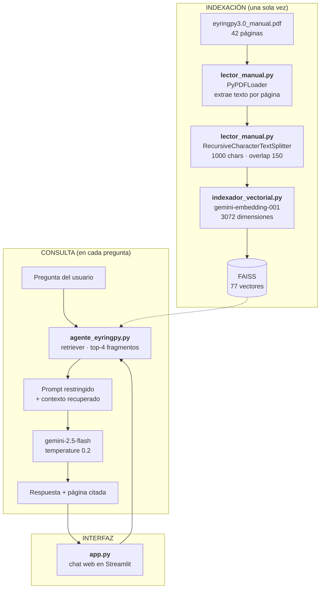
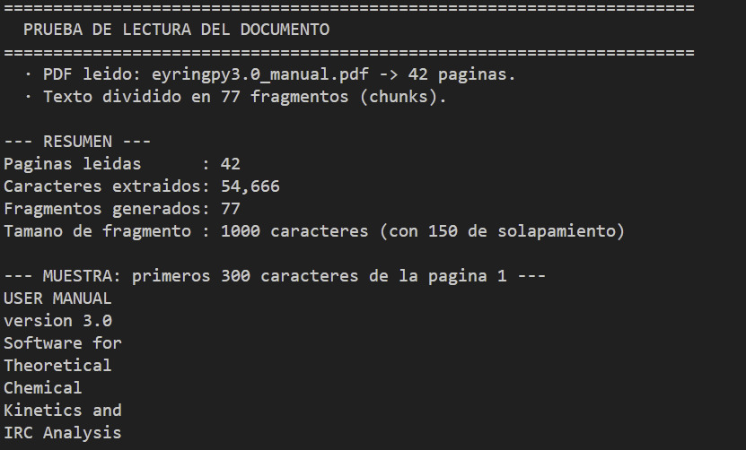
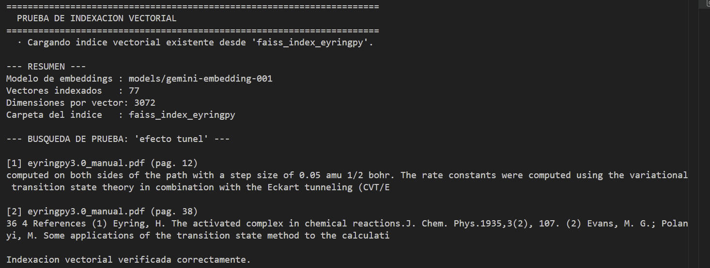
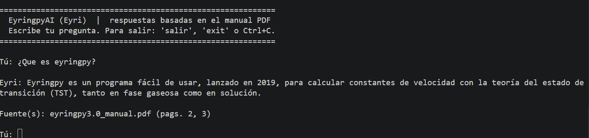
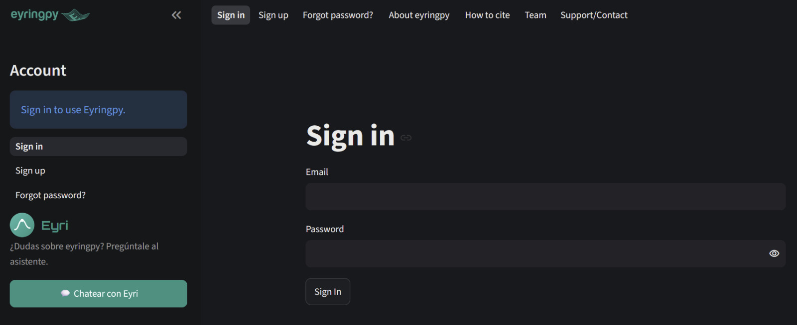
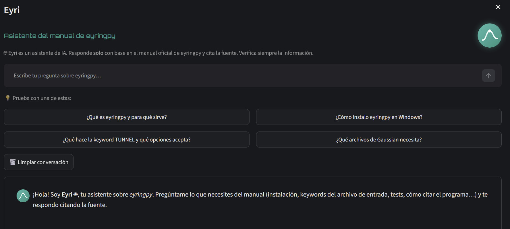
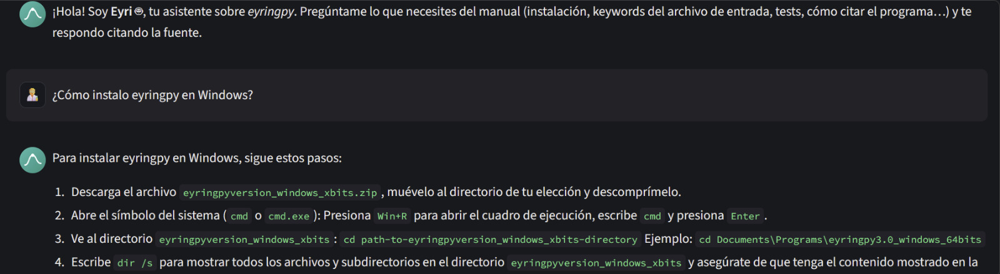

<p align="center">
  
</p>

<h1 align="center">Eyri — Asistente IA para eyringpy</h1>

<p align="center">
  <em>Agente de inteligencia artificial (RAG) que responde preguntas en lenguaje natural sobre el manual del software científico <strong>eyringpy 3.0</strong>, citando la página exacta del documento.</em>
</p>

<p align="center">
  <strong>Desarrolladora:</strong> Aura Ximena Gómez Heredia<br>
  <sub>Challenge Alura Agente — Programa ONE (Oracle Next Education)</sub>
</p>

<p align="center">
  <a href="http://163.192.156.14"><strong>Probar la aplicación desplegada en Oracle Cloud →</strong></a>
</p>

---

## Descripción general

**eyringpy** es un programa escrito en Python para el cálculo de **constantes de velocidad** de reacciones químicas mediante diferentes teorías cinéticas. Su manual es un documento técnico de 42 páginas: instalación, casos de prueba, keywords del archivo de entrada (`.eif`), descripción del archivo de salida y referencias.

Buscar un dato puntual en ese manual —qué hace una keyword, cómo instalarlo, cómo citarlo— consume tiempo. **Eyri** resuelve ese problema: se le pregunta en lenguaje natural y responde de forma directa, basándose **únicamente** en el contenido del manual e indicando **la página exacta** de donde salió la información.

| | |
|---|---|
|**Contexto** | Operacional — procesos y manuales técnicos |
|**Documento fuente** | `eyringpy3.0_manual.pdf` (42 páginas, PDF de texto nativo) |
|**Objetivo** | Responder sin que el usuario tenga que abrir el manual |
|**Anti-alucinación** | Si la respuesta no está en el manual, lo dice explícitamente |
|**Acceso** | Abierto, sin restricción de usuarios |
|**Despliegue** | Oracle Cloud Infrastructure — [http://163.192.156.14](http://163.192.156.14) |

---

## Sobre este repositorio:

Este chatbot fue diseñado para responder preguntas sobre eyringpy y se **insertó dentro del programa original de eyringpy**, desarrollado por nuestro grupo de investigación.

Sin embargo, para poder visualizar el chatbot funcionando dentro de esa plataforma se requiere **todo el repositorio del programa completo**, que no forma parte de este entregable. Por esa razón, este repositorio está organizado así:

| | Qué contiene | Para qué sirve |
|---|---|---|
|**El código** | Una aplicación **independiente en Streamlit** con el chatbot | Permite ejecutar y visualizar **únicamente el chatbot** de este proyecto, sin depender del programa completo de eyringpy |
|**Las imágenes** | Capturas del chatbot funcionando **dentro de la plataforma original** | Evidencian la integración real en el programa de eyringpy ([ver capturas](#-integración-en-la-plataforma-original-de-eyringpy)) |

>**Nota sobre permisos:** soy también desarrolladora de la plataforma eyringpy, por lo que cuento con los permisos necesarios para modificar su código e integrar este asistente en ella. 

En ambos casos **el agente es exactamente el mismo**: los módulos `lector_manual.py`, `indexador_vectorial.py` y `agente_eyringpy.py` no cambian. Lo único distinto es la capa de interfaz que los envuelve.

---

## Arquitectura de la solución

El proyecto implementa un pipeline **RAG (Retrieval-Augmented Generation)**, que funciona en dos momentos:

- **Indexación** — ocurre una sola vez: el PDF se lee, se trocea, se convierte en vectores y se guarda en disco.
- **Consulta** — ocurre en cada pregunta: se buscan los fragmentos relevantes y se le entregan al modelo.



### Módulos y responsabilidades

| Archivo | Responsabilidad | Piezas clave |
|---------|-----------------|--------------|
| **`src/lector_manual.py`** | Accede a la ruta del PDF, valida el archivo, extrae el texto página por página y lo trocea en fragmentos. | `PyPDFLoader`, `RecursiveCharacterTextSplitter` |
| **`src/indexador_vectorial.py`** | Convierte cada fragmento en un vector numérico y construye (o carga) la base vectorial. | `GoogleGenerativeAIEmbeddings`, `FAISS` |
| **`src/agente_eyringpy.py`** | Recupera los fragmentos relevantes, arma el prompt, consulta a Gemini y cita la fuente. | `ChatGoogleGenerativeAI`, `ChatPromptTemplate`, `StrOutputParser` |
| **`src/app.py`** | Interfaz web: pantalla única con el logo de eyringpy y el chat. | `streamlit`, `st.chat_input`, `st.session_state` |

Cada módulo importa del anterior: `app` → `agente_eyringpy` → `indexador_vectorial` → `lector_manual`. Los tres primeros pueden **ejecutarse por separado** para verificarlos.

### Decisiones de diseño

- **Índice cacheado en disco.** Los embeddings se calculan una vez y se guardan en `src/faiss_index_eyringpy/`. Ese índice viene incluido en el repositorio, así que la app arranca sin gastar cuota de API.
- **`@st.cache_resource`.** El agente se construye una sola vez por servidor, no en cada mensaje (Streamlit re-ejecuta todo el script en cada interacción).
- **Historial en `st.session_state`.** La conversación se conserva mientras dure la sesión.
- **`temperature=0.2`** y un prompt que prohíbe el conocimiento externo: el modelo se ciñe al manual.

---

## Tecnologías utilizadas

| Componente | Herramienta | Versión/Modelo |
|------------|-------------|----------------|
| Lenguaje | **Python** | 3.13 en local · 3.12 en el servidor |
| Orquestación del agente | **LangChain** | `langchain`, `langchain-community`, `langchain-core`, `langchain-text-splitters` |
| Modelo de lenguaje (LLM) | **Google Gemini** | `gemini-2.5-flash` |
| Modelo de *embeddings* | **Google** | `gemini-embedding-001` (3072 dim.) |
| Base de datos vectorial | **FAISS** | `faiss-cpu` |
| Lectura del PDF | **pypdf** | vía `PyPDFLoader` |
| Interfaz web | **Streamlit** | `st.chat_input`, `st.chat_message` |
| Gestión de secretos | **python-dotenv** · **st.secrets** | |
| **Nube** | **Oracle Cloud Infrastructure** | Compute · VM.Standard.A1.Flex (Ampere ARM) |
| **Sistema operativo** | **Ubuntu Server** | 24.04 LTS |
| **Servidor web** | **nginx** | proxy inverso con soporte WebSocket |
| **Gestor de servicios** | **systemd** | arranque automático y reinicio ante fallos |

---

## Estructura del proyecto

```
eyringpy-ai-assistant/
│
├── src/                            # Código de la aplicación
│   ├── app.py                      # Interfaz web (Streamlit)
│   ├── agente_eyringpy.py          # Agente: recuperación + Gemini
│   ├── indexador_vectorial.py      # Embeddings + base vectorial FAISS
│   ├── lector_manual.py            # Lectura y troceado del PDF
│   ├── assets/                     # Logos que usa la aplicación
│   │   ├── eyri_icon.png
│   │   └── logo_eyringpy.png
│   └── faiss_index_eyringpy/       # Índice vectorial pre-construido
│       ├── index.faiss
│       └── index.pkl
│
├── data/                           # Documento fuente
│   └── eyringpy3.0_manual.pdf
│
├── docs/                           # Capturas de pantalla del README
│
├── .streamlit/
│   ├── config.toml                 # Tema visual
│   └── secrets.toml.example        # Plantilla de secretos
│
├── requirements.txt                # Dependencias
├── .env.example                    # Plantilla de variables de entorno
├── .gitignore
└── README.md
```

> `src/assets/` vive dentro de `src/` porque la aplicación la necesita en tiempo de ejecución (`app.py` la resuelve como `BASE_DIR / "assets"`). `docs/` está fuera porque es documentación pura: solo la usa este README.

---

## Instalación y ejecución local

Instrucciones para replicar el entorno local desde cero.

### 1. Requisitos previos

- **Python 3.10 o superior** (probado en 3.12 y 3.13). Comprueba tu versión:
  ```bash
  python --version
  ```
- Una **clave de API gratuita de Google AI Studio**: https://aistudio.google.com/app/apikey

### 2. Clonar el repositorio

```bash
git clone https://github.com/auraximena/eyringpy-ai-assistant.git
cd eyringpy-ai-assistant
```

### 3. Crear un entorno virtual (recomendado)

<details>
<summary><strong>Windows (PowerShell)</strong></summary>

```powershell
python -m venv .venv
.venv\Scripts\Activate.ps1
```
</details>

<details>
<summary><strong>Linux / macOS</strong></summary>

```bash
python3 -m venv .venv
source .venv/bin/activate
```
</details>

### 4. Instalar las dependencias

```bash
pip install -r requirements.txt
```

> **Python 3.13:** el proyecto fija `numpy>=2.1`. Las versiones 1.x de numpy no son compatibles con Python 3.13 y fallan al importarse con un `OverflowError`.

### 5. Configurar la clave de API

```bash
# Windows
copy .env.example .env
# Linux / macOS
cp .env.example .env
```

Edita el archivo `.env` y coloca tu clave:

```
GOOGLE_API_KEY=tu_clave_real_de_gemini
```

> El archivo `.env` está en el `.gitignore` y **nunca** debe subirse al repositorio.

### 6. Ejecutar la aplicación web

```bash
streamlit run src/app.py
```

Abre `http://localhost:8501` en el navegador y empieza a preguntar.

### 7. (Opcional) Verificar cada módulo por separado

Cada pieza del pipeline se puede ejecutar de forma independiente:

```bash
cd src

# Lectura del PDF — no necesita clave de API
python lector_manual.py

# Indexación vectorial
python indexador_vectorial.py            # usa el índice existente
python indexador_vectorial.py --rebuild  # lo reconstruye desde el PDF

# Agente en la terminal
python agente_eyringpy.py
python agente_eyringpy.py -q "¿Qué es eyringpy?"
```

> El índice vectorial ya viene construido en el repositorio, así que la app arranca al instante. Si lo borras, se regenera solo en la primera ejecución.

---

## Ejemplos de preguntas y respuestas

Preguntas reales hechas al agente y las respuestas que generó, **basándose exclusivamente en el manual de eyringpy**. Todas citan la página exacta.

### 1. Pregunta general

> **👤 ¿Qué es eyringpy y para qué sirve?**
>
> 🤖 Eyringpy es un programa fácil de usar, lanzado en 2019, para calcular constantes de velocidad con la teoría del estado de transición (TST), tanto en fase gaseosa como en solución.
>
> Sirve para:
> - Obtener la energía de activación de Gibbs calculando las funciones de partición canónicas.
> - Soportar reacciones unimoleculares y bimoleculares con uno o dos productos.
> - Considerar la simetría de la reacción.
> - Aplicar correcciones de tunelización unidimensionales de Wigner y Eckart.
> - Calcular constantes de velocidad en solución (teoría de Collins–Kimball, teoría de Marcus y efecto del pH).
> - Estimar constantes mediante la teoría del estado de transición variacional (CVT) y los modelos de rotor impedido de Pitzer y Gwinn, y Ayala y Schlegel.
> - Escanear la evolución de cambios primitivos a lo largo de la coordenada de reacción intrínseca (IRC).
>
> `Fuente(s): eyringpy3.0_manual.pdf (pags. 2, 3)`

### 2. Procedimiento de instalación

> **👤 ¿Cómo instalo eyringpy en Windows?**
>
> 🤖 Para instalar eyringpy en Windows, sigue estos pasos:
> 1. Descarga el archivo `eyringpyversion_windows_xbits.zip`, muévelo al directorio de tu elección y descomprímelo.
> 2. Abre el símbolo del sistema (`cmd` o `cmd.exe`): Presiona `Win+R`, escribe `cmd` y presiona `Enter`.
> 3. Ve al directorio: `cd path-to-eyringpyversion_windows_xbits-directory`. Ejemplo: `cd Documents\Programs\eyringpy3.0_windows_64bits`
> 4. Escribe `dir /s` para mostrar todos los archivos y asegúrate de que tenga el contenido de la Sección 1.4.
> 5. Añade un alias con `doskey` en un script Batch (`profile.bat`) para ejecutar el programa desde cualquier directorio.
> 6. Crea un acceso directo del `cmd` en el escritorio.
>
> `Fuente(s): eyringpy3.0_manual.pdf (pags. 2, 4, 5)`

### 3. Keyword del archivo de entrada

> **👤 ¿Qué hace la keyword TUNNEL y qué opciones acepta?**
>
> 🤖 La keyword TUNNEL se utiliza para describir el *tunneling* (efecto túnel). Es de tipo *Multiple choice* y sus opciones son **WIG** y **ECK**.
>
> `Fuente(s): eyringpy3.0_manual.pdf (pags. 18, 21, 22, 33)`

### 4. Valor por defecto de un parámetro

> **👤 ¿Cuál es el valor por defecto de la keyword PHASE?**
>
> 🤖 El valor por defecto de la keyword PHASE es **GAS**.
>
> `Fuente(s): eyringpy3.0_manual.pdf (pags. 22, 23, 29, 30)`

### 5. Opciones de un método

> **👤 ¿Qué opciones acepta la keyword METHOD?**
>
> 🤖 Las opciones que acepta la keyword METHOD son **TST** y **CVT**.
>
> `Fuente(s): eyringpy3.0_manual.pdf (pags. 21, 22, 33, 34)`

### 6. Modelos disponibles

> **👤 ¿Qué modelos de rotor impedido están disponibles?**
>
> 🤖 Los modelos de rotor impedido disponibles en eyringpy son los de **Pitzer y Gwinn**, y **Ayala y Schlegel**.
>
> `Fuente(s): eyringpy3.0_manual.pdf (pags. 3, 13, 26)`

### 7. Archivo de salida

> **👤 ¿Cómo se llama el archivo de salida que genera el programa?**
>
> 🤖 El archivo de salida general de Eyringpy se nombra como el directorio en el que se realiza el cálculo de interés (es decir, `foldername.eof`).
>
> `Fuente(s): eyringpy3.0_manual.pdf (pags. 18, 19, 35)`

### 8. Parámetro técnico del IRC

> **👤 ¿Qué tamaño de paso se recomienda para el IRC?**
>
> 🤖 El tamaño de paso típico para el IRC es **0.10 amu<sup>1/2</sup> bohr**, pero debe seleccionarse en función del comportamiento del perfil de energía.
>
> `Fuente(s): eyringpy3.0_manual.pdf (pags. 14, 15, 31, 33)`

### 9. Dato de contacto

> **👤 ¿Cuál es el correo de contacto de eyringpy?**
>
> 🤖 El correo de contacto para eyringpy es **eyringpy2018@gmail.com**.
>
> `Fuente(s): eyringpy3.0_manual.pdf (pags. 2, 3, 17)`

### 10. Pregunta fuera de alcance — control de alucinación 🚫

> **👤 ¿Cuál es la capital de Francia?**
>
> 🤖 No encontré esa información en el manual de eyringpy.

Esta última es tan importante como las demás: el agente **no responde** con conocimiento externo, aunque conozca la respuesta. Solo habla de lo que está en el manual.

---

## Capturas de pantalla

### Funcionamiento de los módulos en local

**1. Lectura y procesamiento del PDF** — `python lector_manual.py`



> Lee las 42 páginas del manual, extrae 54.666 caracteres y los divide en 77 fragmentos.

**2. Indexación vectorial** — `python indexador_vectorial.py`



> Genera los embeddings, construye el índice FAISS y ejecuta una búsqueda semántica de prueba.

**3. Agente en la terminal** — `python agente_eyringpy.py`



> El agente completo respondiendo y citando la página del manual.

---

##  Integración en la plataforma original de eyringpy

El chatbot **no fue concebido como una aplicación aislada**: se insertó dentro del **programa original de eyringpy**, desarrollado por nuestro grupo de investigación, que es una plataforma web construida en Streamlit.

> **Nota sobre permisos:** soy también desarrolladora de la plataforma eyringpy, por lo que cuento con los permisos necesarios para modificar su código e integrar este asistente en ella. Ref: A. Gómez-Heredia, E. Dzib, and G. Merino, “ Microcanonical Rate Constants With Rice–Ramsperger–Kassel–Marcus in Eyringpy,” Journal of Computational Chemistry 46, no. 30 (2025): e70259, https://doi.org/10.1002/jcc.70259. 

**¿Por qué solo se muestran imágenes de esa integración?** Porque para poder ejecutar y visualizar el chatbot dentro de la plataforma haría falta subir **el repositorio completo del programa de eyringpy**, que no forma parte de este entregable. Por eso esta evidencia se presenta mediante capturas, mientras que el **código ejecutable** se entrega como la aplicación independiente de este repositorio.

La integración se hizo de forma **no invasiva**: se añadieron dos archivos nuevos (un widget de chat y un puente con el agente) y **una sola línea** en el archivo principal de la plataforma para registrar el botón. No se modificó ninguna funcionalidad existente.

### Capturas de la integración

**1. Eyri disponible desde la barra lateral de la plataforma**



> El botón «Chatear con Eyri» aparece en la barra lateral y está disponible desde cualquier pestaña del programa, sin necesidad de iniciar sesión.

**2. Ventana de chat desplegada sobre la aplicación**



> El chat se abre como una ventana modal sobre la plataforma: el usuario consulta el manual **sin perder lo que estaba haciendo**, y la conversación se conserva al cambiar de pestaña.

**3. Eyri respondiendo dentro de la plataforma**



> Respuesta a «¿Cómo instalo eyringpy en Windows?» directamente en la interfaz del programa, con los comandos formateados y la cita de la fuente.

---

## Despliegue en Oracle Cloud Infrastructure

La aplicación está **desplegada y accesible públicamente** en una máquina virtual de OCI, dentro del nivel **Always Free**.

<p align="center">
  <a href="http://163.192.156.14"><strong>🔗 http://163.192.156.14</strong></a>
</p>

> Escribe la dirección con el prefijo `http://`. Al no tener certificado TLS, algunos navegadores —sobre todo en móvil— intentan `https://` por su cuenta y no encuentran respuesta.

### Servicios de OCI utilizados

| Servicio | Recurso | Configuración |
|----------|---------|---------------|
| **Compute** | Instancia `eyri-app` | `VM.Standard.A1.Flex` — Ampere ARM, 1 OCPU, 6 GB RAM |
| **Networking** | VCN `vcn-eyri` | Subred **pública** con gateway de Internet |
| **Networking** | Security List | Regla de entrada TCP `80` desde `0.0.0.0/0` |
| **Block Volume** | Volumen de arranque | Ubuntu Server 24.04 LTS |

### Decisiones del despliegue

- **Ampere ARM en lugar de x86.** El nivel Always Free ofrece bastante más memoria en las instancias Ampere, y `faiss-cpu` publica ruedas precompiladas para `aarch64`, así que la instalación no requiere compilar nada.
- **Streamlit escucha solo en `127.0.0.1`.** No se expone directamente a internet: nginx es el único proceso accesible desde fuera, lo que reduce la superficie de ataque.
- **nginx como proxy inverso.** Publica la aplicación en el puerto 80 —URL limpia, sin `:8501`— y reenvía las cabeceras `Upgrade` y `Connection`, imprescindibles porque Streamlit mantiene una conexión WebSocket permanente con el navegador.
- **systemd para la persistencia.** La aplicación arranca sola al encender el servidor y se reinicia automáticamente si el proceso falla (`Restart=always`).
- **La clave de API vive solo en el servidor.** Está en un archivo `.env` con permisos `600`, fuera del repositorio, y systemd la inyecta como variable de entorno mediante `EnvironmentFile`.

### Evidencia del despliegue

**1. La aplicación funcionando en la nube**


> Eyri respondiendo *«¿Cómo instalo eyringpy en Windows?»* desde la dirección pública `http://163.192.156.14`, con la IP visible en la barra del navegador y la cita de las páginas del manual al final de la respuesta.

**2. Instancia activa en la consola de Oracle Cloud**


> La instancia `eyri-app` en estado **En ejecución**, en la región `mx-queretaro-1`. Se aprecian la unidad **VM.Standard.A1.Flex** (Ampere ARM, 1 OCPU, 6 GB de memoria), el sistema operativo **Canonical Ubuntu 24.04 aarch64** y la dirección IP pública, que coincide con la de la captura anterior.

**3. Cortafuegos del servidor configurado**


> Las reglas de `iptables` en el servidor: los puertos **22** (administración por SSH) y **80** (tráfico web público) se aceptan **antes** de la regla `REJECT` final. Que la aplicación sea accesible desde internet (captura 1) confirma además que la *Security List* del VCN —el segundo cortafuegos, del lado de Oracle— también permite el puerto 80.

---

## Notas y limitaciones

- **Fuente única de verdad.** Eyri responde solo con base en el manual indexado. Las preguntas fuera de su alcance reciben el mensaje de *fallback*.
- **Idioma.** El manual está en inglés y las preguntas suelen ser en español. `gemini-embedding-001` es multilingüe, así que mapea el significado a un mismo espacio vectorial. Medido sobre consultas equivalentes ES/EN con términos no cognados.
- **Cuota de la API.** La capa gratuita de Gemini permite un número limitado de peticiones por minuto y por día (20/día para `gemini-2.5-flash`). Al superarlo, el agente devuelve un mensaje de error controlado en lugar de fallar. **Como la aplicación desplegada es de acceso abierto, esa cuota es compartida por todos los visitantes** y puede agotarse en un día de uso intenso.
- **Sin cifrado TLS.** El despliegue usa HTTP. Es suficiente para este caso —no se solicitan credenciales ni datos personales— pero el navegador mostrará el aviso «No es seguro». 

---

## 📄 Créditos

- **Software eyringpy:** E. Dzib, A. Quintal, A. Gómez-Heredia y G. Merino, *Eyringpy 3.0*, Cinvestav Mérida, Yucatán, 2025 — [Merino Research Group](https://www.theochemmerida.org/eyringpy)
- **Challenge:** Alura Latam — Programa ONE (Oracle Next Education)

---

<p align="center">
  <sub> Eyri es un asistente de IA. Verifica siempre la información en el manual oficial de eyringpy.</sub>
</p>
